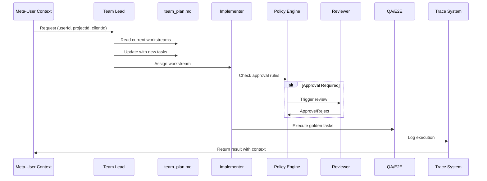

# Agent-Team Operating Model - Implementierungs-Spec

**Version:** 1.0.0  
**Status:** Implementierungs-Ready  
**Zweck:** Vollständige Spezifikation zur Replikation der Agent-Team-Logik mit anpassbaren Meta-User-Kontext-Variablen

---

## 1. Übersicht

Das Agent-Team Operating Model ist ein **repo-internes Governance-System** für Multi-Agent-Kollaboration. Es implementiert:

- **Memory-on-Disk**: Repo-Artefakte als Single Source of Truth
- **Autonomy Ladder**: Gestufte Autonomie-Ebenen mit Approval Gates
- **Policy-Based Approvals**: Automatische Approval-Trigger basierend auf Änderungen
- **Quality Gates**: Golden Tasks + Scorecard-basierte Qualitätssicherung
- **Observability**: Trace Schema für Telemetrie und Cost-Tracking

### 1.1 Kernprinzipien

1. **Repo-Artefakte > Chat-Kontext**: Alle Entscheidungen, Findings und Progress werden in Markdown-Dateien persistiert
2. **Delegation-First**: Team Lead orchestriert, Implementer führen aus
3. **Policy-Driven**: Automatische Approval-Gates basierend auf konfigurierbaren Regeln
4. **Meta-User-Kontext**: Alle Aktionen sind mit `userId`, `projectId`, `clientId` kontextualisiert

---

## 2. Architektur

### 2.1 Komponenten-Übersicht

```
┌─────────────────────────────────────────────────────────────┐
│                    Agent-Team System                        │
├─────────────────────────────────────────────────────────────┤
│                                                             │
│  ┌──────────────┐    ┌──────────────┐    ┌─────────────┐ │
│  │ Team Lead    │───▶│ Orchestrator  │───▶│ Implementer │ │
│  │ (GPT-5.2)    │    │ (Planning)    │    │ (Codex)     │ │
│  └──────────────┘    └──────────────┘    └─────────────┘ │
│         │                    │                    │        │
│         ▼                    ▼                    ▼        │
│  ┌──────────────────────────────────────────────────────┐  │
│  │         Repo Memory Layer (Markdown Files)          │  │
│  │  - team_plan.md    - team_findings.md               │  │
│  │  - team_progress.md - team_decisions.md              │  │
│  └──────────────────────────────────────────────────────┘  │
│         │                    │                    │        │
│         ▼                    ▼                    ▼        │
│  ┌──────────────────────────────────────────────────────┐  │
│  │         Policy & Governance Layer                     │  │
│  │  - policy_approval_rules.yaml                         │  │
│  │  - autonomy_policy.md                                 │  │
│  │  - scorecard_definition.md                            │  │
│  └──────────────────────────────────────────────────────┘  │
│         │                    │                    │        │
│         ▼                    ▼                    ▼        │
│  ┌──────────────────────────────────────────────────────┐  │
│  │         Quality & Observability                       │  │
│  │  - golden_tasks.yaml                                  │  │
│  │  - trace_schema.json                                  │  │
│  └──────────────────────────────────────────────────────┘  │
│                                                             │
└─────────────────────────────────────────────────────────────┘
```

### 2.2 Datenfluss



---

## 3. Meta-User-Kontext Variablen

### 3.1 Kontext-Definition

Alle Agent-Aktionen werden mit einem **Meta-User-Kontext** versehen:

```typescript
type MetaUserContext = {
  // Required
  userId: string;              // Eindeutige User-ID
  
  // Optional (projektabhängig)
  projectId?: string;          // Projekt-Kontext
  clientId?: string;           // Client/Mandant-Kontext
  
  // Erweiterte Kontext-Variablen (anpassbar)
  sessionId?: string;          // Session-Tracking
  organizationId?: string;     // Organisation-Kontext
  workspaceId?: string;         // Workspace-Kontext
  environment?: "dev" | "staging" | "prod";
  
  // Metadata
  metadata?: Record<string, unknown>;
};
```

### 3.2 Kontext-Propagation

Der Kontext wird durch alle Ebenen propagiert:

1. **Input Layer**: User-Request enthält Kontext
2. **Orchestration Layer**: Kontext wird an alle Agenten weitergegeben
3. **Execution Layer**: Tool-Calls erhalten Kontext
4. **Logging Layer**: Alle Actions werden mit Kontext geloggt
5. **Trace Layer**: Traces enthalten vollständigen Kontext

### 3.3 Kontext-Anpassung

**Variablen können pro Repository/Organisation angepasst werden:**

```yaml
# ops/agent-team/context_config.yaml (optional)
context_variables:
  required:
    - userId
  optional:
    - projectId
    - clientId
    - sessionId
    - organizationId
    - workspaceId
  custom:
    # Repo-spezifische Variablen
    - tenantId
    - departmentId
    - costCenterId
```

---

## 4. Implementierungskomponenten

### 4.1 Team Lead / Orchestrator

**Verantwortlichkeiten:**
- Task-Decomposition in Workstreams
- Owner-Zuweisung
- Deadline-Management
- Decision Logging

**Implementierung:**

```typescript
interface TeamLeadOrchestrator {
  // Kontext-basierte Initialisierung
  initialize(context: MetaUserContext): Promise<void>;
  
  // Workstream-Management
  decomposeTask(
    task: string,
    context: MetaUserContext
  ): Promise<Workstream[]>;
  
  assignOwner(
    workstream: Workstream,
    owner: AgentRole,
    context: MetaUserContext
  ): Promise<void>;
  
  // Plan-Updates
  updateTeamPlan(
    updates: PlanUpdate[],
    context: MetaUserContext
  ): Promise<void>;
  
  // Decision Logging
  logDecision(
    decision: Decision,
    context: MetaUserContext
  ): Promise<void>;
}

type Workstream = {
  id: string;
  title: string;
  owner: string; // @role_id
  status: "todo" | "in_progress" | "blocked" | "in_review" | "done";
  scope: string[]; // file paths
  autonomyTier: 1 | 2 | 3 | 4;
  nextAction: string;
  blockers: string[];
  context: MetaUserContext; // Kontext wird mitgespeichert
};
```

### 4.2 Policy Approval Engine

**Zweck:** Automatische Approval-Trigger basierend auf Änderungen

**Implementierung:**

```typescript
interface PolicyApprovalEngine {
  // Rule-Matching
  evaluateRules(
    changes: ChangeSet,
    context: MetaUserContext
  ): Promise<ApprovalRequirement[]>;
  
  // Approval-Status
  checkApprovalStatus(
    requirement: ApprovalRequirement,
    context: MetaUserContext
  ): Promise<ApprovalStatus>;
}

type ChangeSet = {
  filesChanged: number;
  locChanged: number;
  pathsTouched: string[];
  operations: string[];
  context: MetaUserContext;
};

type ApprovalRequirement = {
  ruleId: string;
  requiredApprovals: number;
  approverRoles: string[];
  confirmationRequired: boolean;
  context: MetaUserContext;
};

type ApprovalStatus = {
  approved: boolean;
  approvals: Approval[];
  pending: string[];
  context: MetaUserContext;
};

type Approval = {
  role: string;
  userId: string;
  timestamp: string;
  context: MetaUserContext;
};
```

**Rule-Matching-Logik:**

```typescript
function matchRule(
  rule: ApprovalRule,
  changes: ChangeSet
): boolean {
  // Large Change Rule
  if (rule.id === "large_change") {
    return (
      changes.filesChanged > rule.match.files_changed_gt &&
      changes.locChanged > rule.match.loc_changed_gt
    );
  }
  
  // Destructive Ops Rule
  if (rule.id === "destructive_ops") {
    return rule.match.operations_any.some(op =>
      changes.operations.includes(op)
    );
  }
  
  // Path-Based Rules
  if (rule.match.touches_paths_any) {
    return rule.match.touches_paths_any.some(pattern =>
      changes.pathsTouched.some(path => matchPattern(path, pattern))
    );
  }
  
  return false;
}
```

### 4.3 Autonomy Ladder Enforcement

**Zweck:** Gestufte Autonomie-Kontrolle

**Implementierung:**

```typescript
interface AutonomyEnforcer {
  checkAutonomy(
    agent: AgentRole,
    action: Action,
    context: MetaUserContext
  ): Promise<AutonomyCheckResult>;
}

type AutonomyTier = 1 | 2 | 3 | 4;

const AUTONOMY_LADDER: Record<AutonomyTier, AutonomyLevel> = {
  1: {
    name: "read-only",
    allowedActions: ["read_repo", "read_artifacts"],
    requiresApproval: true,
  },
  2: {
    name: "draft-only",
    allowedActions: ["read_repo", "write_markdown", "draft_changes"],
    requiresApproval: true,
  },
  3: {
    name: "execute-with-approval",
    allowedActions: ["read_repo", "write_files", "run_tests"],
    requiresApproval: true,
  },
  4: {
    name: "autonomous-with-limits",
    allowedActions: ["read_repo", "write_files", "run_tests", "merge"],
    requiresApproval: false, // Nur für kritische Aktionen
  },
};

type AutonomyCheckResult = {
  allowed: boolean;
  reason?: string;
  requiredApproval?: boolean;
  context: MetaUserContext;
};
```

### 4.4 Team Memory Manager

**Zweck:** Persistierung aller Team-Entscheidungen und Findings

**Implementierung:**

```typescript
interface TeamMemoryManager {
  // Plan Management
  readTeamPlan(context: MetaUserContext): Promise<TeamPlan>;
  updateTeamPlan(
    updates: PlanUpdate[],
    context: MetaUserContext
  ): Promise<void>;
  
  // Findings Log
  appendFinding(
    finding: Finding,
    context: MetaUserContext
  ): Promise<void>;
  
  // Progress Log
  logProgress(
    entry: ProgressEntry,
    context: MetaUserContext
  ): Promise<void>;
  
  // Decision Records
  recordDecision(
    decision: Decision,
    context: MetaUserContext
  ): Promise<void>;
}

type Finding = {
  timestamp: string; // ISO-8601
  owner: string; // @role_id
  finding: string;
  impact: string;
  suggestedAction: string;
  context: MetaUserContext;
};

type ProgressEntry = {
  timestamp: string; // ISO-8601
  owner: string; // @role_id
  action: string;
  result: string;
  links: string[];
  next: string;
  context: MetaUserContext;
};

type Decision = {
  date: string; // ISO-8601
  decision: string;
  rationale: string;
  alternatives: string[];
  implications: string[];
  owner: string; // @role_id
  context: MetaUserContext;
};
```

**Markdown-Parsing:**

```typescript
function parseTeamPlan(markdown: string): TeamPlan {
  // Parse Markdown-Tabelle für Workstreams
  const workstreams = parseMarkdownTable(markdown, "Workstreams");
  
  // Parse Milestones
  const milestones = parseMarkdownCheckboxes(markdown, "Milestones");
  
  // Parse Approval Gates
  const approvalGates = parseMarkdownCheckboxes(markdown, "Approval Gates Needed");
  
  return {
    workstreams,
    milestones,
    approvalGates,
  };
}

function appendFinding(
  markdown: string,
  finding: Finding
): string {
  const entry = `- ${finding.timestamp} — [${finding.owner}] ${finding.finding} — ${finding.impact} — ${finding.suggestedAction}`;
  return markdown.replace(
    /## Entries\n/,
    `## Entries\n${entry}\n`
  );
}
```

### 4.5 Quality Gate System

**Zweck:** Golden Tasks + Scorecard-basierte Qualitätssicherung

**Implementierung:**

```typescript
interface QualityGateSystem {
  // Golden Tasks Execution
  runGoldenTasks(
    context: MetaUserContext
  ): Promise<GoldenTaskResults>;
  
  // Scorecard Evaluation
  evaluateScorecard(
    results: GoldenTaskResults,
    context: MetaUserContext
  ): Promise<ScorecardResult>;
  
  // Gate Decision
  checkGate(
    scorecard: ScorecardResult,
    context: MetaUserContext
  ): Promise<GateDecision>;
}

type GoldenTask = {
  id: string;
  name: string;
  command: string;
  expected: "exit_code_0" | "output_contains" | "custom";
  expectedValue?: string;
};

type GoldenTaskResult = {
  taskId: string;
  passed: boolean;
  output: string;
  duration: number;
  context: MetaUserContext;
};

type ScorecardResult = {
  outcomeQuality: number; // 0-2
  toolSelection: number; // 0-2
  inputQuality: number; // 0-2
  errorHandling: number; // 0-2
  sideEffects: number; // 0-2
  safetyCompliance: number; // 0-2
  efficiency: number; // 0-2
  total: number; // 0-14
  criticalSafetyFail: boolean;
  successRateRegression?: number;
  costPerSuccessRegression?: number;
  context: MetaUserContext;
};

type GateDecision = {
  passed: boolean;
  reason?: string;
  requiredActions?: string[];
  context: MetaUserContext;
};
```

**Gate-Policy-Logik:**

```typescript
function evaluateGate(
  scorecard: ScorecardResult,
  policy: GatePolicy
): GateDecision {
  // Critical Safety Check
  if (scorecard.criticalSafetyFail) {
    return {
      passed: false,
      reason: "Critical safety failure detected",
    };
  }
  
  // Success Rate Regression
  if (
    scorecard.successRateRegression &&
    scorecard.successRateRegression > policy.fail_conditions.success_rate_regression_pct_gt
  ) {
    return {
      passed: false,
      reason: `Success rate regression: ${scorecard.successRateRegression}%`,
    };
  }
  
  // Cost Regression
  if (
    scorecard.costPerSuccessRegression &&
    scorecard.costPerSuccessRegression > policy.fail_conditions.cost_per_success_regression_pct_gt
  ) {
    return {
      passed: false,
      reason: `Cost per success regression: ${scorecard.costPerSuccessRegression}%`,
    };
  }
  
  return { passed: true };
}
```

### 4.6 Trace & Observability System

**Zweck:** Telemetrie und Cost-Tracking

**Implementierung:**

```typescript
interface TraceSystem {
  // Trace Creation
  createTrace(
    request: TraceRequest,
    context: MetaUserContext
  ): Promise<Trace>;
  
  // Trace Completion
  completeTrace(
    traceId: string,
    result: TraceResult,
    context: MetaUserContext
  ): Promise<void>;
  
  // Cost Tracking
  trackCost(
    trace: Trace,
    context: MetaUserContext
  ): Promise<CostRecord>;
}

type TraceRequest = {
  requestType: string;
  promptVersion: string;
  model: string;
  context: MetaUserContext;
};

type Trace = {
  traceId: string;
  requestType: string;
  promptVersion: string;
  model: string;
  tokensIn: number;
  tokensOut: number;
  toolCalls: ToolCallTrace[];
  latencyTotalMs: number;
  loopCount: number;
  errorFlag: boolean;
  costEstimateUsd?: number;
  redactedFields: string[];
  context: MetaUserContext;
  createdAt: string;
  completedAt?: string;
};

type ToolCallTrace = {
  name: string;
  status: "ok" | "error" | "timeout";
  latencyMs: number;
  retries: number;
};

type CostRecord = {
  traceId: string;
  costUsd: number;
  tokensIn: number;
  tokensOut: number;
  model: string;
  context: MetaUserContext;
  timestamp: string;
};
```

**Trace-Schema-Validierung:**

```typescript
function validateTrace(trace: Trace): ValidationResult {
  const schema = loadSchema("ops/agent-team/trace_schema.json");
  return validate(trace, schema);
}

function redactTrace(trace: Trace): Trace {
  const redacted = { ...trace };
  
  // Redact secrets
  if (trace.context.metadata) {
    redacted.context.metadata = redactSecrets(trace.context.metadata);
    redacted.redactedFields.push("metadata.secrets");
  }
  
  // Redact PII
  if (trace.context.userId) {
    redacted.context.userId = hashUserId(trace.context.userId);
    redacted.redactedFields.push("context.userId");
  }
  
  return redacted;
}
```

---

## 5. Konfiguration & Anpassung

### 5.1 Repo-spezifische Konfiguration

**Datei:** `ops/agent-team/config.yaml`

```yaml
# Meta-User-Kontext Konfiguration
context:
  required_variables:
    - userId
  optional_variables:
    - projectId
    - clientId
    - sessionId
  custom_variables:
    # Repo-spezifische Variablen hier definieren
    - tenantId
    - departmentId

# Team-Konfiguration
team:
  default_lead_model: "GPT-5.2 Thinking"
  exception_model:
    name: "Claude Opus 4.6"
    max_runs_per_week: 3
  language: "de" # oder "en", "fr", etc.

# Autonomy Defaults
autonomy:
  repo_default_tier: 2
  implementer_default_tier: 3

# Quality Gates
quality:
  golden_tasks_minimum: 25
  scorecard_fail_threshold: 5 # Prozent-Regression
  cost_fail_threshold: 10 # Prozent-Regression
```

### 5.2 Policy Rules Anpassung

**Datei:** `ops/agent-team/policy_approval_rules.yaml`

```yaml
rules:
  # Repo-spezifische Rules hinzufügen
  - id: custom_rule
    match:
      touches_paths_any: ["**/custom/**"]
    require:
      approvals: 1
      approver_roles: ["reviewer_claude"]
      context_filter:
        # Nur für bestimmte Kontexte
        projectId: ["project-123", "project-456"]
        clientId: ["client-abc"]
```

### 5.3 Golden Tasks Anpassung

**Datei:** `ops/agent-team/golden_tasks.yaml`

```yaml
golden_tasks:
  minimum_required: 25
  context_aware: true # Tasks können kontextabhängig sein
  tasks:
    - id: "GT-001"
      name: "Repo health: typecheck"
      command: "pnpm -r typecheck"
      expected: "exit_code_0"
      context_filter:
        # Nur für bestimmte Projekte
        projectId: ["project-123"]
    
    - id: "GT-CUSTOM"
      name: "Custom task"
      command: "custom-command"
      expected: "exit_code_0"
      context_required:
        - clientId # Erfordert clientId im Kontext
```

---

## 6. Integration mit Bestehendem System

### 6.1 Orchestrator Integration

**Anpassung des bestehenden Orchestrators:**

```typescript
// packages/agent-runtime/src/orchestrator/orchestrator.ts

import { TeamLeadOrchestrator } from "@agent-team/orchestrator";
import { PolicyApprovalEngine } from "@agent-team/policy";
import { TeamMemoryManager } from "@agent-team/memory";

export class Orchestrator {
  constructor(
    // ... bestehende Dependencies
    private readonly teamLead: TeamLeadOrchestrator,
    private readonly policyEngine: PolicyApprovalEngine,
    private readonly memoryManager: TeamMemoryManager
  ) {}

  async run(ctx: ToolContext, input: AgentRunInput): Promise<{ status: "ok" | "blocked"; data: unknown }> {
    // Meta-User-Kontext erweitern
    const metaContext: MetaUserContext = {
      userId: ctx.userId,
      projectId: ctx.projectId,
      clientId: ctx.clientId,
      // ... weitere Kontext-Variablen
    };

    // Policy-Check vor Ausführung
    const changes = this.extractChanges(input);
    const approvals = await this.policyEngine.evaluateRules(changes, metaContext);
    
    if (approvals.length > 0) {
      const status = await this.policyEngine.checkApprovalStatus(approvals[0], metaContext);
      if (!status.approved) {
        return {
          status: "blocked",
          data: { reason: "Approval required", reviewId: status.pending[0] },
        };
      }
    }

    // Memory-Logging
    await this.memoryManager.logProgress({
      timestamp: new Date().toISOString(),
      owner: `@${input.agentId}`,
      action: "agent.run",
      result: "executed",
      links: [],
      next: "awaiting result",
      context: metaContext,
    }, metaContext);

    // ... bestehende Ausführungs-Logik
  }
}
```

### 6.2 Tool Router Integration

**Kontext-Propagation zu Tools:**

```typescript
// packages/agent-runtime/src/execution/tool-router.ts

export class ToolRouter {
  async execute(
    profile: AgentProfile,
    ctx: ToolContext,
    call: ToolCall
  ): Promise<ToolResult> {
    // Meta-User-Kontext erweitern
    const metaContext: MetaUserContext = {
      userId: ctx.userId,
      projectId: ctx.projectId,
      clientId: ctx.clientId,
    };

    // Autonomy-Check
    const autonomyCheck = await this.autonomyEnforcer.checkAutonomy(
      profile,
      { type: "tool_call", tool: call.tool },
      metaContext
    );

    if (!autonomyCheck.allowed) {
      return {
        ok: false,
        error: autonomyCheck.reason ?? "Autonomy check failed",
      };
    }

    // Tool-Ausführung mit Kontext
    const handler = this.handlers[call.tool];
    const result = await handler.call(metaContext, call.input);

    // Trace-Logging
    await this.traceSystem.logToolCall({
      tool: call.tool,
      context: metaContext,
      result,
    });

    return result;
  }
}
```

---

## 7. Implementierungs-Schritte

### Phase 1: Core Infrastructure

1. **Team Memory Manager implementieren**
   - Markdown-Parser für `team_plan.md`, `team_findings.md`, etc.
   - CRUD-Operationen für Memory-Files
   - Kontext-Integration

2. **Policy Approval Engine implementieren**
   - YAML-Parser für `policy_approval_rules.yaml`
   - Rule-Matching-Logik
   - Approval-Status-Tracking

3. **Autonomy Enforcer implementieren**
   - Autonomy-Ladder-Definition
   - Check-Logik
   - Integration mit Policy Engine

### Phase 2: Quality & Observability

4. **Quality Gate System implementieren**
   - Golden Tasks Executor
   - Scorecard Evaluator
   - Gate Decision Logic

5. **Trace System implementieren**
   - Trace-Schema-Validierung
   - Cost-Tracking
   - Redaction-Logik

### Phase 3: Integration

6. **Orchestrator Integration**
   - Team Lead Orchestrator
   - Policy-Checks vor Ausführung
   - Memory-Logging

7. **Tool Router Integration**
   - Kontext-Propagation
   - Autonomy-Checks
   - Trace-Logging

### Phase 4: Testing & Validation

8. **Unit Tests**
   - Alle Komponenten testen
   - Kontext-Propagation validieren
   - Policy-Rules testen

9. **Integration Tests**
   - End-to-End-Workflows
   - Approval-Flows
   - Quality Gates

10. **Golden Tasks validieren**
    - Alle Tasks ausführen
    - Scorecard evaluieren
    - Dokumentation aktualisieren

---

## 8. Variablen-Anpassung Guide

### 8.1 Meta-User-Kontext erweitern

**Schritt 1:** `context_config.yaml` erstellen/anpassen

```yaml
context_variables:
  required:
    - userId
  optional:
    - projectId
    - clientId
  custom:
    - tenantId      # Neue Variable
    - departmentId # Neue Variable
```

**Schritt 2:** TypeScript-Typen aktualisieren

```typescript
type MetaUserContext = {
  userId: string;
  projectId?: string;
  clientId?: string;
  tenantId?: string;      // Neu
  departmentId?: string;  // Neu
};
```

**Schritt 3:** Kontext-Propagation aktualisieren

Alle Komponenten, die `MetaUserContext` verwenden, müssen die neuen Variablen unterstützen.

### 8.2 Repo-spezifische Anpassungen

**Beispiel: Multi-Tenant-System**

```yaml
# ops/agent-team/config.yaml
context:
  custom_variables:
    - tenantId
    - subscriptionTier

policy_rules:
  # Tenant-spezifische Rules
  - id: premium_features
    match:
      touches_paths_any: ["**/premium/**"]
    require:
      approvals: 1
      approver_roles: ["reviewer_claude"]
    context_filter:
      subscriptionTier: ["premium", "enterprise"]
```

**Beispiel: Department-basierte Approvals**

```yaml
policy_rules:
  - id: finance_changes
    match:
      touches_paths_any: ["**/finance/**"]
    require:
      approvals: 2
      approver_roles: ["finance_reviewer", "reviewer_claude"]
    context_filter:
      departmentId: ["finance"]
```

---

## 9. Beispiel-Implementierung

### 9.1 Vollständiger Workflow

```typescript
// Beispiel: Feature-Implementierung mit Agent-Team

async function implementFeature(
  feature: string,
  context: MetaUserContext
): Promise<FeatureResult> {
  // 1. Team Lead initialisieren
  const teamLead = new TeamLeadOrchestrator();
  await teamLead.initialize(context);

  // 2. Task decomponieren
  const workstreams = await teamLead.decomposeTask(feature, context);

  // 3. Workstreams zuweisen
  for (const ws of workstreams) {
    await teamLead.assignOwner(ws, "@implementer_codex", context);
  }

  // 4. Team Plan aktualisieren
  await teamLead.updateTeamPlan(
    workstreams.map(ws => ({ type: "add", workstream: ws })),
    context
  );

  // 5. Implementer ausführen
  const implementer = new Implementer();
  const results = [];

  for (const ws of workstreams) {
    // Policy-Check
    const changes = await implementer.previewChanges(ws, context);
    const approvals = await policyEngine.evaluateRules(changes, context);

    if (approvals.length > 0) {
      const status = await policyEngine.checkApprovalStatus(approvals[0], context);
      if (!status.approved) {
        // Blockiert - Approval erforderlich
        await memoryManager.appendFinding({
          timestamp: new Date().toISOString(),
          owner: "@implementer_codex",
          finding: `Workstream ${ws.id} requires approval`,
          impact: "Blocked",
          suggestedAction: "Wait for approval",
          context,
        }, context);
        continue;
      }
    }

    // Ausführung
    const result = await implementer.execute(ws, context);
    results.push(result);

    // Progress loggen
    await memoryManager.logProgress({
      timestamp: new Date().toISOString(),
      owner: "@implementer_codex",
      action: `Execute workstream ${ws.id}`,
      result: result.status,
      links: result.links,
      next: "Review",
      context,
    }, context);
  }

  // 6. Quality Gates
  const qa = new QualityGateSystem();
  const taskResults = await qa.runGoldenTasks(context);
  const scorecard = await qa.evaluateScorecard(taskResults, context);
  const gateDecision = await qa.checkGate(scorecard, context);

  if (!gateDecision.passed) {
    return {
      status: "blocked",
      reason: gateDecision.reason,
      requiredActions: gateDecision.requiredActions,
    };
  }

  // 7. Decision loggen
  await teamLead.logDecision({
    date: new Date().toISOString(),
    decision: `Feature ${feature} implemented`,
    rationale: "All workstreams completed, quality gates passed",
    alternatives: [],
    implications: ["Feature ready for review"],
    owner: "@teamlead_orchestrator",
    context,
  }, context);

  return {
    status: "ok",
    workstreams: results,
    scorecard,
  };
}
```

---

## 10. Testing-Strategie

### 10.1 Unit Tests

```typescript
describe("PolicyApprovalEngine", () => {
  it("should match large_change rule", async () => {
    const engine = new PolicyApprovalEngine();
    const changes: ChangeSet = {
      filesChanged: 25,
      locChanged: 600,
      pathsTouched: [],
      operations: [],
      context: { userId: "user-123" },
    };

    const approvals = await engine.evaluateRules(changes, changes.context);
    expect(approvals).toHaveLength(1);
    expect(approvals[0].ruleId).toBe("large_change");
  });

  it("should respect context filters", async () => {
    const engine = new PolicyApprovalEngine();
    const changes: ChangeSet = {
      filesChanged: 1,
      locChanged: 10,
      pathsTouched: ["**/premium/**"],
      operations: [],
      context: {
        userId: "user-123",
        subscriptionTier: "basic", // Sollte blockiert werden
      },
    };

    const approvals = await engine.evaluateRules(changes, changes.context);
    // Sollte premium_features rule triggern, aber context filter blockiert
    expect(approvals[0].contextFilter).toBeDefined();
  });
});
```

### 10.2 Integration Tests

```typescript
describe("Agent Team Workflow", () => {
  it("should complete full feature implementation", async () => {
    const context: MetaUserContext = {
      userId: "user-123",
      projectId: "project-456",
      clientId: "client-789",
    };

    const result = await implementFeature("new-feature", context);

    expect(result.status).toBe("ok");
    expect(result.workstreams).toBeDefined();
    expect(result.scorecard.total).toBeGreaterThan(10);

    // Memory-Files sollten aktualisiert sein
    const plan = await memoryManager.readTeamPlan(context);
    expect(plan.workstreams.length).toBeGreaterThan(0);
  });
});
```

---

## 11. Migration & Rollout

### 11.1 Bestehendes System migrieren

1. **Backup bestehender Struktur**
2. **Agent-Team-Dateien hinzufügen** (nicht überschreiben)
3. **Kontext-Variablen identifizieren** aus bestehendem System
4. **Policy-Rules anpassen** an bestehende Workflows
5. **Golden Tasks definieren** basierend auf bestehenden Tests
6. **Schrittweise Aktivierung** (Feature-Flag)

### 11.2 Rollout-Plan

**Phase 1: Read-Only (1 Woche)**
- Alle Komponenten im Read-Only-Modus
- Nur Logging, keine Enforcement
- Kontext-Tracking aktivieren

**Phase 2: Draft-Only (1 Woche)**
- Memory-Files werden geschrieben
- Keine Approvals erforderlich
- Policy-Rules werden evaluiert (nur Logging)

**Phase 3: Approval-Gates (2 Wochen)**
- Approvals für kritische Änderungen
- Quality Gates aktivieren
- Feedback sammeln

**Phase 4: Vollständige Aktivierung**
- Alle Features aktiv
- Monitoring & Optimierung

---

## 12. Monitoring & Metriken

### 12.1 Key Metrics

```typescript
type AgentTeamMetrics = {
  // Durchsatz
  tasksCompleted: number;
  workstreamsCompleted: number;
  averageCompletionTime: number;

  // Qualität
  scorecardAverage: number;
  goldenTasksPassRate: number;
  criticalSafetyFailures: number;

  // Approvals
  approvalsRequired: number;
  approvalsPending: number;
  averageApprovalTime: number;

  // Kosten
  costPerTask: number;
  costPerSuccess: number;
  totalCost: number;

  // Kontext-Verteilung
  contextDistribution: Record<string, number>;
};
```

### 12.2 Dashboards

- **Team Performance Dashboard**: Workstream-Status, Completion-Rates
- **Quality Dashboard**: Scorecard-Trends, Golden Tasks Pass-Rate
- **Cost Dashboard**: Cost-per-Task, Cost-per-Success, Trends
- **Approval Dashboard**: Pending Approvals, Approval-Times

---

## 13. Troubleshooting

### 13.1 Häufige Probleme

**Problem:** Policy-Rules triggern nicht
- **Lösung:** Rule-Matching-Logik prüfen, Pattern-Matching validieren

**Problem:** Kontext wird nicht propagiert
- **Lösung:** Alle Komponenten auf Kontext-Propagation prüfen

**Problem:** Memory-Files werden nicht aktualisiert
- **Lösung:** File-Permissions prüfen, Markdown-Parser validieren

**Problem:** Quality Gates schlagen fehl
- **Lösung:** Golden Tasks manuell ausführen, Scorecard-Thresholds anpassen

---

## 14. Referenzen

- **Spec:** `ops/agent-team/agent_team_spec.v1.yaml`
- **Policy Rules:** `ops/agent-team/policy_approval_rules.yaml`
- **Trace Schema:** `ops/agent-team/trace_schema.json`
- **Golden Tasks:** `ops/agent-team/golden_tasks.yaml`
- **Root Guidelines:** `AGENTS.md`

---

## 15. Changelog

### Version 1.0.0 (2026-02-12)
- Initiale Implementierungs-Spec
- Meta-User-Kontext-Variablen definiert
- Vollständige Architektur-Beschreibung
- Implementierungs-Guide
- Testing-Strategie

---

**Ende der Spec**

