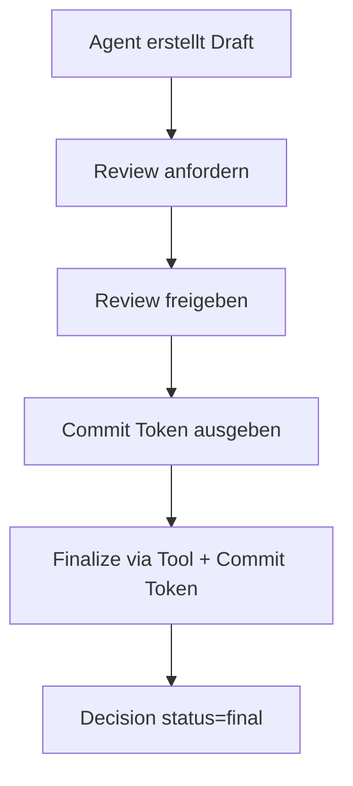
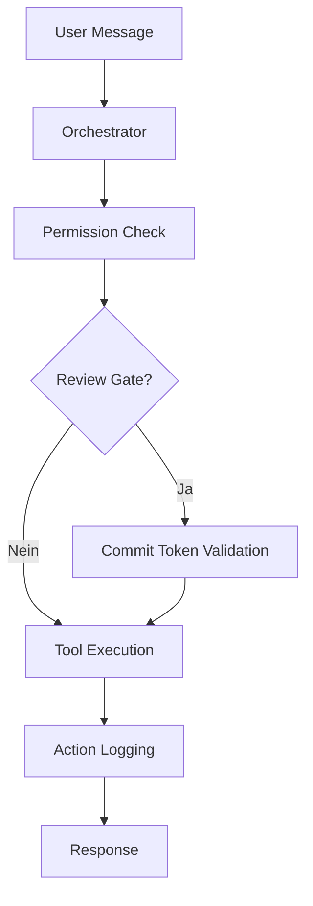

# IST-Zustand: Agent-System als Unterstützender Mitarbeiter / Prozess-Optimierungs-Layer

**Erstellt:** 2026-02-13  
**Aktualisiert:** 2026-02-18  
**Zweck:** Vollständige Dokumentation des aktuellen Systemzustands im Kontext des Agent-Systems als unterstützender Mitarbeiter und Prozess-Optimierungs-Layer

---
## 1. System-Übersicht & Architektur-Prinzipien

### 1.1 Architektur-Übersicht

Das Agent-System folgt einer **Agent-first-Architektur** mit klarer Trennung:

- **`apps/`**: Oberflächen und API-Grenzen. Keine Business-Logik.
- **`packages/agent-runtime`**: Agenten-Definitionen, Orchestrator, Execution-Layer.
- **`packages/governance`** (V1): Policy-Enforcement, Review-Engine, Action-Logging.
- **`packages/governance-v2`**: Self-validating Meta-Layer mit Clock-Abstraktion, Bridge-Pattern.
- **`packages/customer-data`**: Customer Data Plane mit Connector-Registry, Capability-Registry.
- **`packages/workflow`**, **`packages/knowledge`**: Datengetriebene Services als reine Verträge.
- **`packages/shared`**: Typen, DTOs, Constants ohne Verhalten.
- **`packages/premium`**: Premium-Module (z.B. Generalist Marketer).
- **`infrastructure/`**: DB-, Vektor- und Speicherkonfigurationen.

### 1.2 System-Übersicht

Das Agent-System ist eine **Agent-first-Architektur** zur Unterstützung von Projektarbeit und Entscheidungsfindung. Es fungiert als **unterstützender Mitarbeiter** und **Prozess-Optimierungs-Layer**, der:

- Strukturierte Entscheidungsfindung (Draft → Review → Commit → Final) orchestriert
- Governance und Compliance durch Policy-basierte Gates sicherstellt
- Knowledge-Management und Kontext-Retrieval bereitstellt
- Projektphasen-Management und Workflow-Steuerung unterstützt
- Monitoring und Drift-Erkennung für Qualitätssicherung bietet

### 1.3 Architektur-Prinzipien

- **Agent-first**: Business-Logik liegt in Agent-Runtime, nicht in Apps
- **Separation of Concerns**: Apps (`apps/`) sind nur Oberflächen, Packages (`packages/`) enthalten die Logik
- **Governance by Design**: Alle kritischen Aktionen durchlaufen Review-Gates
- **Memory-on-Disk**: Repo-Artefakte als Single Source of Truth
- **Policy-Driven**: Automatische Approval-Gates basierend auf konfigurierbaren Regeln
- **V2-First**: Governance-V2 als primäre Architektur-Säule mit deterministischer Clock-Abstraktion
- **Bridge-Pattern**: Nahtlose Migration von V1 zu V2 über Adapter

---

## 2. Komponenten-Architektur

### 2.1 Apps (Oberflächen)

#### `apps/web` (Next.js)
- **Zweck**: Nutzer- und Admin-Oberfläche
- **Status**: Implementiert mit Dashboard-Seiten
- **Seiten**:
  - **Audit Ledger**: Audit-Log-Übersicht mit "Verify Integrity" Feature
  - **Approval Inbox**: Review-Queue, Approval-Flow
  - **Fleet Monitor**: Agent-Status-Übersicht
  - **Governance Matrix**: Governance-Übersicht
- **Komponenten**:
  - **Layout**: MainLayout, Sidebar
  - **Governance**: AdvisorCard (PolicyViolationAdvice)
  - **API-Client**: PolicyError-Handling, fetchApi-Wrapper
- **Business-Logik**: Keine (nur UI-Komponenten)

#### `apps/api` (NestJS)
- **Zweck**: API-Orchestrator als Systemgrenze
- **Status**: Vollständig implementiert mit folgenden Modulen:
  - **Agents**: Agent-Execution, Tool-Routing, Escalation-Logging
  - **Decisions**: Draft-Erstellung, Finalisierung (nur via Tool), DTO-Validation
  - **Knowledge**: Projekt-scoped Search (Decisions, Reviews, Logs)
  - **Monitoring**: Drift-Metriken (5 Metriken: Rejection Rate, Missing Logs, Rework, Escalation, Completeness)
  - **Projects**: Projektkontext, Phase-Management, Phase-Hints
  - **Reviews**: Review-Queue, Approval-Flow, Commit-Token-Generierung
  - **Logs**: Action-Log-Zugriff

### 2.2 Packages (Business-Logik)

#### `packages/agent-runtime`
- **Zweck**: Agenten-Definitionen, Orchestrator, Execution-Layer
- **Komponenten**:
  - **Orchestrator**: Agent-Run-Orchestrierung, Permission-Enforcement, Review-Gate-Validierung, Commit-Token-Validierung
  - **Agents**: 5 Agent-Typen (Knowledge, Project, Documentation, Junior, Governance)
  - **Execution**: Tool-Router, Tool-Permissions, Tool-Context
  - **Profiles**: Agent-Profile-Definitionen (JSON-basiert)

#### `packages/governance` (V1)
- **Zweck**: Policy-Enforcement, Review-Engine, Action-Logging
- **Komponenten**:
  - **Policy Engine**: Authorization, Sanitization, Redaction, License-Management
  - **Policies**: Action-Policy, Review-Policy
  - **Enforcement**: Permission-Checks, Review-Gate-Enforcement
  - **Review**: Review-Engine, Review-Queue (PostgreSQL-basiert)
  - **Logging**: Action-Logger (PostgreSQL-basiert)
  - **License Manager**: Premium-Feature Access Control

#### `packages/governance-v2`
- **Zweck**: Self-validating Meta-Layer mit Clock-Abstraktion
- **Komponenten**:
  - **Clock-Abstraktion**: `FakeClock` (Tests), `SystemClock` (Produktion)
  - **Bridge-Pattern**: `V1PolicyEngineAdapter` für V1→V2 Migration
  - **Validators**: Workstream-Validator, Document-Header-Validator
  - **Compiler**: Decision-Compiler mit Policy-Integration
  - **Clarification**: Ambiguity-Detector, Conflict-Detector
  - **Scorecard**: Governance-Scorecard-Engine
  - **Audit**: Audit-Runner für CI-Integration
  - **Runtime**: Governance-Hook, Runtime-State-Store, Time-Utils

#### `packages/customer-data`
- **Zweck**: Customer Data Plane für sicheren Datenzugriff
- **Komponenten**:
  - **Connector Registry**: Single- und Multi-Source-Routing
  - **Capability Registry**: Operation-Allowlisting, Schema-Validation
  - **Constraints**: Field-Filtering, MaxRows, DenyFields
  - **Result Hash**: Deterministische Hash-Generierung (PII-exklusiv)

#### `packages/knowledge`
- **Zweck**: Knowledge-API, Embeddings, Retrieval
- **Status**: Grundgerüst vorhanden
- **Komponenten**: Embeddings, Ingestion (Chunker, Parser), Retrieval (Search)

#### `packages/workflow`
- **Zweck**: Datengetriebene Projektlogik, Phasen-Management
- **Komponenten**: Phase-Runner, Escalation, Validator, YAML-Definitionen

#### `packages/shared`
- **Zweck**: Typen, DTOs, Errors (keine Logik)
- **Types**:
  - `decision.ts`: Decision-Types mit Section-Struktur (META, INTERNAL, CLIENT, OUTCOME, GOVERNANCE)
  - `review.ts`: Review-Types, CommitToken
  - `agent.ts`: Agent-Profile, Permissions, Memory-Scope
  - `project-phase.ts`: ProjectPhase Enum
  - `governance.ts`: PolicyViolationAdvice für AdvisorCard

#### `packages/premium/marketer`
- **Zweck**: Premium-Modul "Generalist Marketer" mit Data-Driven Storytelling
- **Komponenten**:
  - **MarketerAgent**: Narrative-Generierung mit Framework-Support (PAS, AIDA)
  - **KPIParser**: Semantische Trend-Analyse, Problem-Translation
  - **Marketing-Tool**: Policy-Integration, PII-Redaction

### 2.3 Infrastructure

#### Datenbank (PostgreSQL)
- **Schema**: `infrastructure/db/schema.sql`
- **Migrationen**:
  - `001_init.sql`: Basis-Schema (decisions, review_requests, review_actions, action_logs, projects)
  - `002_review_commit_token.sql`: Commit-Token-Support
  - `003_decisions_domain.sql`: Erweiterte Decision-Felder
  - `004_project_phases.sql`: Project-Phase-Support
- **pgvector**: Vektor-Support für Embeddings (`infrastructure/vector/pgvector.sql`)
- **Runtime**: PostgreSQL-basierte Implementierungen (PostgresActionLogger, PostgresReviewQueue, PostgresReviewStore)

#### Storage
- **Zweck**: Datei-Storage-Konnektoren
- **Status**: Grundgerüst vorhanden

---

## 3. Kern-Workflows

### 3.1 Decision Lifecycle (Draft → Review → Commit → Final)

**Implementierung**:
- ✅ Draft-Erstellung: `POST /projects/:projectId/decisions/draft` (REST) oder `tool.decisions.createDraft` (Tool)
- ✅ Review-Flow: Review-Request → Approval → Commit-Token
- ✅ Finalisierung: **Nur via Tool** (`tool.decisions.finalizeFromDraft`) mit Commit-Token
- ✅ Governance: `reviewId` ist required für Final-Status (Type + Runtime-Check)
- ✅ Hardening: Status-Check, Review-Approval-Check, Project-Match-Check, Logging-Enforcement

### 3.2 Agent-Execution-Flow

**Implementierung**:
- ✅ Orchestrator: Permission-Enforcement, Review-Gate-Validierung, Commit-Token-Validierung
- ✅ Tool-Router: Tool-Aufrufe mit Context (userId, projectId, clientId)
- ✅ Action-Logging: Append-only Audit-Trail (PostgreSQL)
- ✅ Escalation-Logging: Governance-Verletzungen werden als Escalation-Events geloggt

### 3.3 Knowledge-Search

**Implementierung**:
- ✅ Projekt-scoped Search: `GET /knowledge/search?projectId=...&q=...`
- ✅ Quellen: Decisions, Reviews, Action-Logs
- ✅ Audit-Logging: Search-Aktionen werden geloggt (blockiert wenn Logging fehlschlägt)
- ✅ Tool-Integration: `tool.knowledge.search` verfügbar

### 3.4 Monitoring & Drift-Erkennung

**Metriken** (5 Metriken):
1. **reviewRejectionRate**: Anteil abgelehnter Reviews
2. **missingLogIncidents**: Fehlende Log-Einträge
3. **reworkCount**: Anzahl Rework-Aktionen
4. **escalationRate**: Anzahl Escalation-Events
5. **decisionCompleteness**: Vollständigkeit von Decisions

**Implementierung**:
- ✅ Endpoint: `GET /monitoring/drift?from=...&to=...`
- ✅ Read-only Queries auf bestehende Tabellen
- ✅ Playbook: `docs/drift_playbook.md` mit Schwellenwerten und Maßnahmen
- ✅ Anti-Gaming: Wöchentliche Stichprobe

---

## 4. Governance & Compliance

### 4.1 Review-Gates

- **Finalisierung**: Nur via Tool mit Commit-Token (kein REST-Endpoint)
- **Hardening**: Status-Check, Review-Approval-Check, Project-Match-Check
- **Logging-Enforcement**: Logging-Fehler blockieren Finalisierung

### 4.2 Permission-System

- **Agent-Profile**: Definieren Permissions pro Agent
- **Enforcement**: `enforcePermission()` prüft Agent-Permissions
- **Tool-Permissions**: Tools sind mit Permissions verknüpft

### 4.3 Action-Logging

- **Append-only**: Alle Aktionen werden in `action_logs` geloggt
- **Context**: userId, projectId, clientId, agentId
- **Blocked Actions**: Governance-Verletzungen werden als `blocked=true` geloggt
- **Escalation-Events**: Governance-Verletzungen werden als Escalation-Events geloggt

### 4.4 Escalation-Logging

**Trigger Points**:
- Orchestrator: `invalid_commit_token`, `commit_mismatch`, `payload_tamper`
- Decisions Service: `finalize_invalid_status`, `finalize_review_not_found`, `finalize_review_not_approved`, `finalize_project_mismatch`

**Implementierung**:
- ✅ Helper: `apps/api/src/modules/agents/escalation-log.ts`
- ✅ Monitoring: Escalation-Rate wird in Drift-Metriken erfasst

---

## 5. Agent-Team Operating Model

### 5.1 Repo-Integration

**Mandatory Repo Artifacts**:
- `ops/agent-team/team_plan.md`: Workstreams, Owners, Status, Blockers
- `ops/agent-team/team_findings.md`: Discoveries, Root Causes, Gotchas
- `ops/agent-team/team_progress.md`: Timestamped Execution Log
- `ops/agent-team/team_decisions.md`: Decision Records

**Prinzipien**:
- **Repo-Artefakte > Chat-Kontext**: Single Source of Truth
- **Memory-on-Disk**: Alle Entscheidungen und Findings werden persistiert
- **Autonomy Ladder**: Gestufte Autonomie-Ebenen mit Approval Gates
- **Golden Tasks**: Baseline Tasks für Qualitätssicherung
- **Scorecard**: Scoring Rubric + Gates

### 5.2 Default Roles

- **Team Lead / Orchestrator**: GPT-5.2 Thinking (delegate-first)
- **Implementer**: Codex
- **Reviewer**: Claude (Review-only)
- **QA/E2E**: Playwright + Golden Tasks

### 5.3 Safety / Guardrails

- Keine Secrets/`.env` lesen/schreiben
- Bestätigung vor destruktiven Aktionen
- Approval Rules: `policy_approval_rules.yaml` prüfen vor Merge

---

## 6. Implementierungs-Status

### 6.1 Abgeschlossen (BLOCK 1-6)

- ✅ **BLOCK 1**: Shared Decision Types mit Section-Struktur
- ✅ **BLOCK 1.5**: Barrel-File vollständig (review.ts exportiert)
- ✅ **BLOCK 2**: DTO/Schema Validation (CreateDecisionDraftDto)
- ✅ **BLOCK 2.1**: Governance Purity (kein REST finalize Endpoint)
- ✅ **BLOCK 3**: Review Gate Hardening + Logging Enforcement
- ✅ **BLOCK 4**: Drift Monitoring (5 Metriken)
- ✅ **BLOCK 4.1**: Escalation Instrumentation
- ✅ **BLOCK 5**: Knowledge Search (Decisions, Reviews, Logs)
- ✅ **BLOCK 6**: Projektkontext & Phasen-Hinweise

### 6.2 Neu (Governance-V2 & Premium)

- ✅ **Governance-V2 Framework**: Clock-Abstraktion (`FakeClock`/`SystemClock`) für deterministische, replay-fähige Tests
- ✅ **V1PolicyEngineAdapter**: Bridge-Pattern für nahtlose V1→V2 Migration
- ✅ **Hash-Integrität**: 100%ige Validierung von Policy-Decisions via deterministische Hashes (Level 3 Stress-Test bestanden)
- ✅ **Premium-Modul "Generalist Marketer"**: KI-Extension mit KPI-Parsing, semantischer Trend-Analyse, Policy-Integration
- ✅ **Live-Verify UI**: Audit-Ledger mit "Verify Integrity" Feature für Hash-Validierung im Dashboard
- ✅ **Customer Data Plane**: Connector-Registry, Capability-Registry, Constraints, Result-Hash

### 6.3 In Entwicklung / Erweiterungen

- ⚠️ **Knowledge-Embeddings**: Vektor-Search (Grundgerüst vorhanden, pgvector-Support vorhanden)
- ⚠️ **Workflow-Engine**: Erweiterte Phase-Runner-Logik (Grundgerüst vorhanden)
- ⚠️ **Golden Tasks**: E2E-Tests (Definiert in `docs/golden-tasks/`, teilweise implementiert)
- ⚠️ **CI-Integration**: Governance-Audit-Runner für kontinuierliche Validierung

---

## 7. Technische Details

### 7.1 Tech-Stack

- **Backend**: NestJS (TypeScript)
- **Frontend**: Next.js (TypeScript)
- **Datenbank**: PostgreSQL + pgvector
- **Package Manager**: pnpm (Monorepo)
- **Node Version**: >=20

### 7.2 Datenbank-Schema

**Kern-Tabellen**:
- `decisions`: Draft/Final Decisions mit Section-Feldern
- `review_requests`: Review-Requests mit Commit-Token
- `review_actions`: Review-History (approve, reject, comment)
- `action_logs`: Append-only Audit-Trail
- `projects`: Projekt-Metadaten

**Constraints**:
- `decisions.status`: CHECK (`'draft'`, `'final'`)
- `decisions.review_id`: NULL erlaubt (Draft), required (Final)
- `action_logs`: Append-only (keine Updates/Deletes)

### 7.3 Type-System

- **Shared Types**: `packages/shared/src/types/`
- **Section-Struktur**: Decision-Types sind nach Sections organisiert (META, INTERNAL, CLIENT, OUTCOME, GOVERNANCE)
- **Type-Safety**: TypeScript strict mode, keine `any`-Types

---

## 8. Prozess-Optimierungs-Aspekte

### 8.1 Unterstützender Mitarbeiter

Das System unterstützt Projektarbeit durch:

- **Strukturierte Entscheidungsfindung**: Draft → Review → Commit → Final
- **Kontext-Retrieval**: Knowledge-Search für vergangene Decisions, Reviews, Logs
- **Projektphasen-Management**: Phase-Hints, Review-Checklists, Common Risks
- **Governance-Automatisierung**: Policy-basierte Gates, automatische Escalation

### 8.2 Prozess-Optimierung

Das System optimiert Prozesse durch:

- **Drift-Monitoring**: Erkennung von Qualitätsabweichungen (Rejection Rate, Missing Logs, Escalations)
- **Audit-Trail**: Vollständige Nachvollziehbarkeit aller Aktionen
- **Review-Gates**: Verhindert Fehler durch strukturierte Review-Prozesse
- **Knowledge-Management**: Wiederverwendung von Erfahrungen und Entscheidungen

---

## 9. Nächste Schritte

1. **Workflow-Engine**: Phase-Runner und Escalation-Logik vollständig implementieren
2. **Knowledge-Embeddings**: Vektor-Search für semantische Suche
3. **UI (apps/web)**: Nutzer-Oberfläche für Decisions, Reviews, Monitoring
4. **Golden Tasks**: E2E-Tests implementieren
5. **Scorecard-Automatisierung**: Scoring Rubric automatisiert ausführen

---

## 10. Zusammenfassung

Das Agent-System ist als **unterstützender Mitarbeiter** und **Prozess-Optimierungs-Layer** konzipiert. Es bietet:

- ✅ Strukturierte Entscheidungsfindung mit Governance-Gates
- ✅ Knowledge-Management und Kontext-Retrieval
- ✅ Projektphasen-Management und Workflow-Steuerung
- ✅ Monitoring und Drift-Erkennung
- ✅ Vollständige Audit-Trails und Escalation-Handling

**Status**: Kern-Funktionalität implementiert (BLOCK 1-6), Workflow-Engine und UI noch offen.

