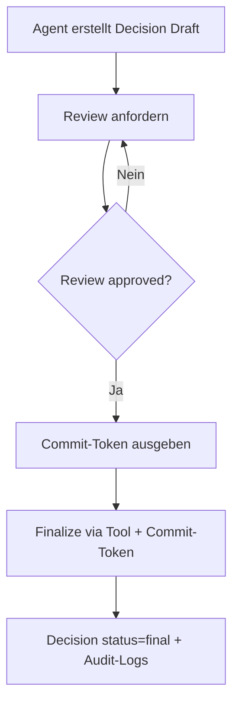
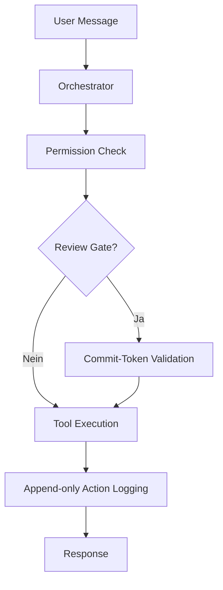

# Onepager (Architektur): Agentensystem – Komponenten, Flows, Gates

**Ziel:** Architekturüberblick über Logik, Usecases und Rollen des Agentensystems – kompakt, auditierbar, repo-nah.

## Architekturprinzipien
- **Agent-first**: Kernlogik liegt im Agent-/Runtime-Layer, nicht in UIs.
- **Governance-by-Design**: Kritische Aktionen sind durch **Review-Gates** technisch erzwungen.
- **Memory-on-Disk**: Repo-Artefakte + append-only Logs als Single Source of Truth.
- **Projekt-Scope überall**: Knowledge/Monitoring/Actions sind projekt-scharf.

## Bausteine (High-Level)
- **`apps/web` (Next.js)**: UI (Grundgerüst) – keine Business-Logik.
- **`apps/api` (NestJS)**: Systemgrenze/Orchestrator-API mit Modulen:
  - Agents (Execution, Tool-Routing, Escalations)
  - Decisions (Draft-Erstellung; Finalisierung ausschließlich via Tool)
  - Reviews (Review-Queue; Approval; Commit-Token)
  - Knowledge (projekt-scharfe Suche)
  - Monitoring (Drift-Metriken + Playbook-Anbindung)
  - Projects (Kontext + Phase-Hints; optional Phase-Update mit Audit-Logging)
  - Logs (Audit-Trail Zugriff)
- **Packages (Logik/Policies)**:
  - `packages/agent-runtime`: Orchestrator, Agents, Tool-Permissions, Profiles
  - `packages/governance`: Policies, Review-Engine, Action-Logging
  - `packages/shared`: Types/DTOs (u. a. Decision Sections, CommitToken, ProjectPhase)
  - `packages/knowledge`, `packages/workflow`: Grundgerüste (Embeddings/Phase-Runner)
- **DB (PostgreSQL + pgvector)**: Persistenz für Decisions/Reviews/Logs; Vektor-Support vorbereitet.

## Haupt-Flow: Decision Lifecycle (Draft → Review → Commit → Final)

**Wichtige Invarianten (enforced):**
- Finalisierung nur nach **Review-Approval** + **Commit-Token** (kein REST-Bypass).
- **Status-Check**: nur Draft → Final.
- **Project-Match**: Review und Decision müssen zum selben Projekt gehören.
- **Logging-Enforcement**: fehlendes Audit-Logging blockiert Finalisierung.

## Agent-Execution-Flow (Orchestrierung + Tools)

## Rollen & Verantwortlichkeiten (Operating Model)
- **Orchestrator (GPT-5.2 Thinking)**: plant/delegiert, setzt Grenzen, erzwingt Gates.
- **Implementer (Codex)**: implementiert Änderungen/Tasks innerhalb der Grenzen.
- **Reviewer (Claude, review-only)**: prüft, stoppt Risiken, bewertet Qualität.
- **QA/E2E (Playwright + Golden Tasks)**: verifiziert Kernpfade, Smoke/Regression.

## Observability: Drift Monitoring (Qualität als Signal)
**Metriken (read-only, auditierbar):**
- reviewRejectionRate, missingLogIncidents, reworkCount, escalationRate, decisionCompleteness

## „Wo liegt was?“ (Repo-Navigation)
- **Detailarchitektur & Status**: `docs/ist-zustand-agent-system.md`
- **Governance/Operating Model**: `ops/agent-team/*` (Plan/Findings/Progress/Decisions, Policies, Golden Tasks)

